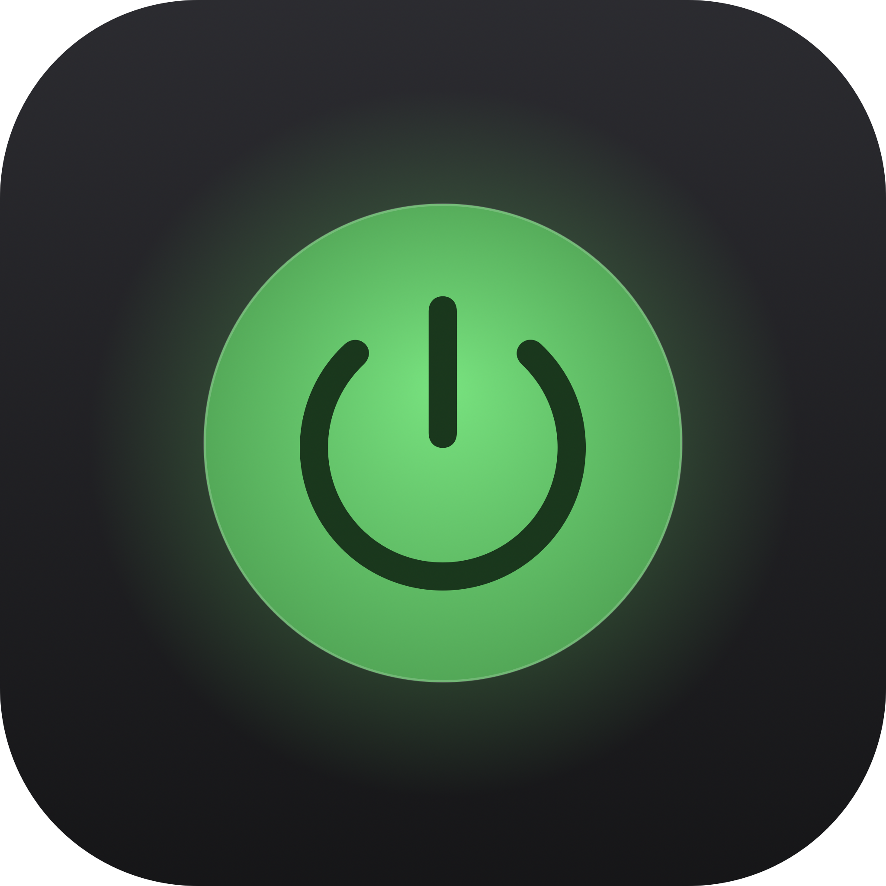
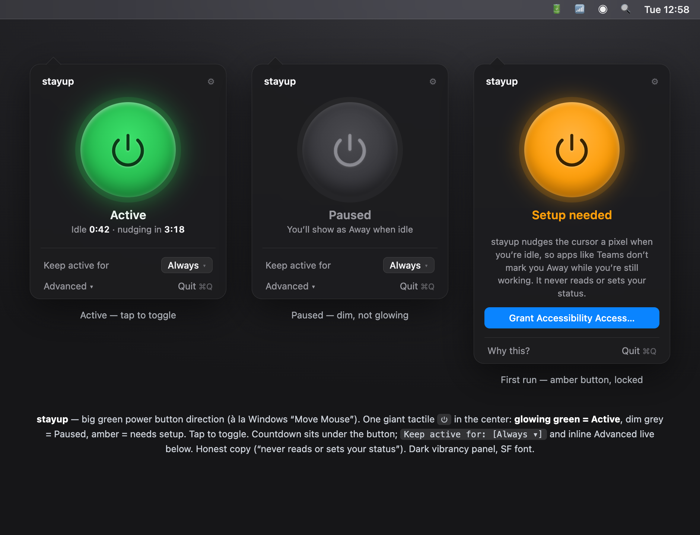
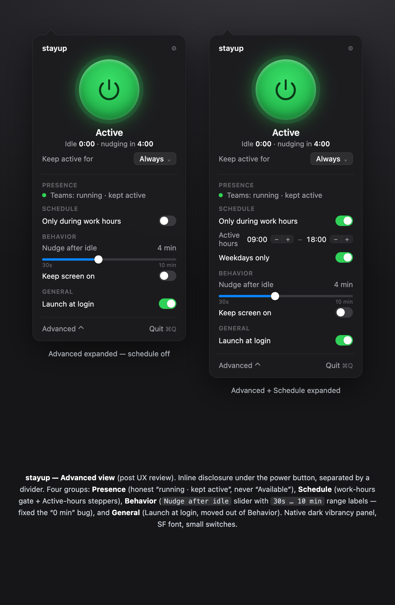

<div align="center">



# stayup

### Stay green in Teams & Slack — one tap.

[](https://github.com/orzazade/stayup/actions/workflows/ci.yml)
[](https://swift.org/)
[](https://www.apple.com/macos/)
[](LICENSE)

**A macOS menu bar app with one big green power button. Tap it, and your Mac stops reporting you as idle while you're still working — so Teams and Slack don't flip you to Away.**

<br/>



</div>

---

## The Problem

You're at your desk reading a long document, on a call, or thinking. You haven't
touched the mouse in five minutes. Teams decides you're **Away** and tells your
whole team so.

macOS reports you as "idle" the instant you stop moving the mouse, and Teams,
Slack, and friends trust that signal blindly. It's a bad proxy for "is this
person actually working."

Most "keep awake" apps don't fix this — they only stop the *display* from
sleeping (`caffeinate`), which does nothing to the input-idle timer your chat app
reads. So you stay Away anyway.

## The Solution

**stayup** posts a single, invisible one-pixel cursor nudge when you've actually
been idle for a while. That resets the same idle timer Teams and Slack read, so
you keep showing as Available — without the cursor visibly moving.

One tap on the big green power button. That's the whole app.

### What stayup honestly is

stayup **never reads, sets, or reports your Teams/Slack status.** It can't — it
makes no network calls of any kind. All it does is keep your Mac from going idle
**while you've switched it on**. It's honest by construction: it makes no presence
claim, it just stops a false-idle signal. You're in control — turn it off when you
step away.

## ✨ Features

- **One big green power button** — glowing green = active, dim = paused. Tap to toggle.
- **Actually keeps you Available** — resets the input-idle timer, not just the display.
- **Timed sessions** — "keep me active for 1h / 2h / 4h" for that one long meeting, then auto-off.
- **Work-hours schedule** — only active Mon–Fri 9–6 (configurable), if you want.
- **Keeps your Mac awake** — holds a power assertion while active so it never idle-sleeps.
- **Keep screen on** — turn this on to stay green even when you walk away: it keeps the display
  lit so the Mac never *locks*. (macOS ignores the nudge once the screen is locked, so with this
  off you'll go Away when it locks — which is the honest outcome.)
- **Invisible** — net-zero cursor movement, only fires when you're genuinely idle.
- **Private** — zero network calls, zero telemetry, ever.
- **Native & tiny** — pure SwiftUI, no Electron, no dependencies beyond a hotkey lib.

## 📦 Installation

### Homebrew (recommended)

```bash
brew install --cask orzazade/tap/stayup
```

### Manual

Download the latest `stayup-x.y.z.zip` from
[Releases](https://github.com/orzazade/stayup/releases/latest), unzip, and drag
`stayup.app` to `/Applications`.

### First launch — grant Accessibility

stayup needs **Accessibility** permission to post the cursor nudge. On first
launch it shows a setup screen with a button that opens the right settings pane.
Enable **stayup** under System Settings → Privacy & Security → Accessibility.

## 🚀 Usage

- Click the menu bar icon → tap the **green power button** to start.
- Pick a duration under **Keep active for** for a timed session.
- Open **Advanced ▾** for presence detection, work-hours schedule, idle
  threshold, **Keep screen on**, and launch-at-login.
- Global hotkey: **⌘⇧U** toggles Active/Paused from anywhere.

<div align="center">

</div>

## 🔍 How it works

```
 while Active:
   hold an IOKit power assertion   → the Mac won't idle-sleep
                                     (so it keeps working even with the screen off)
 every 1s:
   read input-idle seconds  (CGEventSource, the same value Teams reads)
   if idle ≥ threshold:
       post mouseMoved +1px, then mouseMoved back   ← net-zero nudge
```

The nudge updates the combined-session idle counter that Electron apps query via
`powerMonitor.getSystemIdleTime()`, so your status stays Available. No cursor
jump, no `cliclick`, no daemon. The power assertion keeps the Mac awake so the
nudge keeps firing. One caveat from macOS: **once the screen locks, the OS ignores
synthetic input**, so you go Away. Turn on **Keep screen on** to prevent the lock
and stay green while away from your desk.

## 🤝 Contributing

PRs welcome. Build locally with:

```bash
swift build
swift run        # runs as a menu bar app
./dist/build.sh  # produces dist/stayup.app
```

## License

[MIT](LICENSE) © 2026 Orkhan Rzazade
